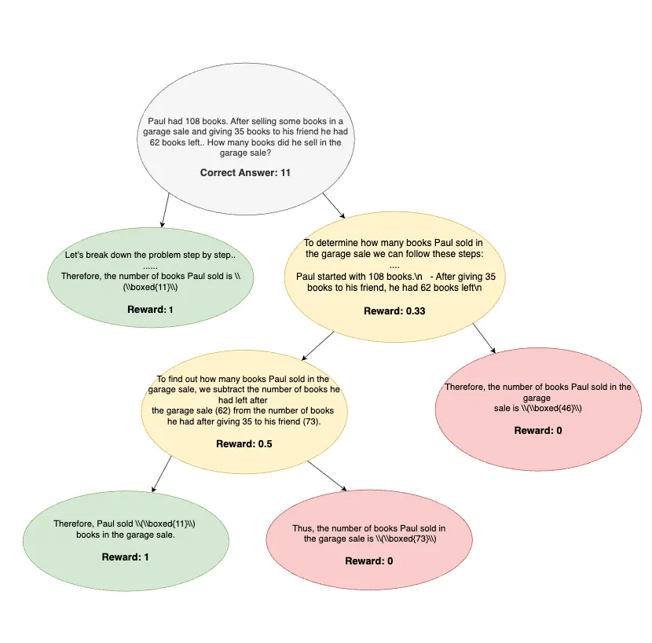

# TreeRPO: Hierarchical Credit Assignment for Reasoning in Language Models

TreeRPO is a hierarchical extension of GRPO that grows a reasoning tree during training and assigns each intermediate node a reward equal to the average correctness of its descendant leaves—turning sparse pass/fail checks into smooth, step-level credit without a critic or reward model.



**Write‑up:** https://omrisapir.substack.com/p/treerpo-hierarchical-credit-assignment

---

## Installation

Clone the repo and install from source:

```bash
cd treerpo
pip install -e .
```

> Dependencies: see `requirements.txt`.

---

## Models

- **Base model:** `Qwen/Qwen2.5-Math-1.5B`
- **Starting checkpoint for RL (TreeRPO) phase:** `omrisap/Qwen2.5-Math-1.5B-5K-SFT`

---

## Quickstart

### Train (single GPU)

Minimal command with sensible defaults (beta=0, single GPU, vLLM-backed tree expansion):

```bash
python -m treerpo.cli train   --model_id omrisap/Qwen2.5-Math-1.5B-5K-SFT   --dataset AI-MO/NuminaMath-CoT   --per_device_train_batch_size 16   --output_dir ./checkpoints/treerpo   --save_steps 200   --save_total_limit 2   --logging_steps 50   --gpu_memory_utilization 0.4   --enable_prefix_caching   --torch_dtype bfloat16   --max_depth 7   --min_segment_len 150   --entropy_threshold 1.0   --entropy_topk 20   --coverage_min_chars 150   --coverage_children_max 4   --temperature 0.6   --top_p 0.85   --top_k 25   --repetition_penalty 1.1   --max_new_tokens 1300
```

### GSM8K Evaluation

Greedy (deterministic) and Maj@8 are supported from the CLI. Settings:

- **Greedy:** `temperature=0.0`, `max_new_tokens=1024`, with `top_k=None`, `top_p=None`, `min_p=None`, `repetition_penalty=None`.
- **Maj@8:** `K=8`, `temperature=0.7`, `top_p=0.8`, same `max_new_tokens=1024`, with `top_k=None`, `min_p=None`, `repetition_penalty=None`.
- If the model does not emit a `\boxed{…}` answer, the sample is counted as incorrect.
- Tie in majority vote is broken at random among tied answers.

Run:

```bash
python -m treerpo.cli eval-gsm8k   --model_id omrisap/TreeRPO-Qwen2.5-Math-1.5B
```

This prints both Greedy and Maj@8 accuracies to stdout.

---

## Reference Numbers (GSM8K Test)

| Model                          | Greedy (%) | Maj@8 (%) |
|--------------------------------|------------|-----------|
| Qwen2.5-Math-1.5B-Instruct     | 84.8       | 89.5      |
| **Qwen2.5-Math-1.5B-TreeRPO**  | **86.4**   | **89.6**  |

---

## License

This project is licensed under the **Apache License 2.0**.

---

## Citation

If you find this work useful, please cite the project and read the write‑up:

> Sapir, O. & Erlihson, M. **TreeRPO: Hierarchical Credit Assignment for Reasoning in Language Models** (2025).  
> https://omrisapir.substack.com/p/treerpo-hierarchical-credit-assignment
